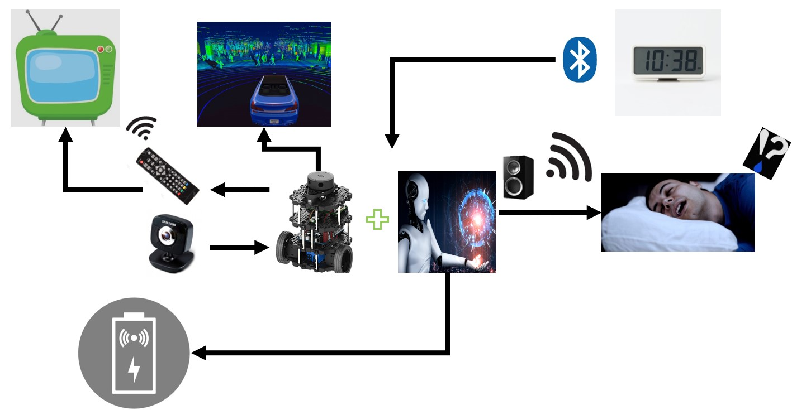

# Team: SystemError

## GoodMorningFairy

### Problem Definition

```
일상의 복잡성, 아침에 일어나는 어려움, 수면장애를 개선 한다.
```

### Use Case

```
1. 시간 정보 입력.
2. 정해진 시간에 정해진 위치로 이동.
3. 기상 시간에 알람 울림.
4. 사용자 알람 종료 시 무선 충전으로 이동.
5. 평상시 IR 리모컨 동작.
```

### High Level Design



### UML

![./img//UMLimg.jpg(./img//UMLimg.jpg)

### Work Breakdown Sheet

| Date  | Settings | AI  |   ROS  | APP | H/W | Ass'y |
| ----- | -------- | --- | ------ | --- | --- | ----- |
| 09.11 | ○        | ○   | ○      | ○   | ○   |       |
| 09.12 | ○        | ○   | ○      | ○   | ○   |       |
| 09.13 |          | ○   | ○      | ○   | ○   |       |
| 09.14 |          | ○   | ○      | ○   | ○   |       |
| 09.15 |          | ○   | ○      | ○   | ○   |       |
| 09.18 |          | ○   | ○      | ○   | ○   |       |
| 09.19 |          | ○   | ○      | ○   | ○   |       |
| 09.20 |          | ○   | ○      | ○   | ○   |       |
| 09.21 |          | ○   | ○      | ○   | ○   |       |
| 09.22 |          | ○   | ○      | ○   | ○   |       |
| 09.25 |          | ○   | ○      | ○   | ○   |       |
| 09.26 |          | ○   | ○      | ○   | ○   |       |
| 09.27 |          | ○   | ○      | ○   | ○   |       |
| 10.04 |          |     |        |     |     | ○     |
| 10.05 |          |     |        |     |     | ○     |
| 10.06 |          |     |        |     |     | ○     |

### Members

| Name      | Role        |
| --------- | ----------- |
| 김동성(C) | ROS, SLAM   |
| 김지원    | ROS, SLAM   |
| 김준호    | H/W, APP    |
| 장영주    | AI          |
| 조윤재    | H/W, APP    |

### Repository

https://github.com/GgobukGgobuk/GoodMorningFairy
